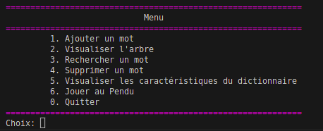
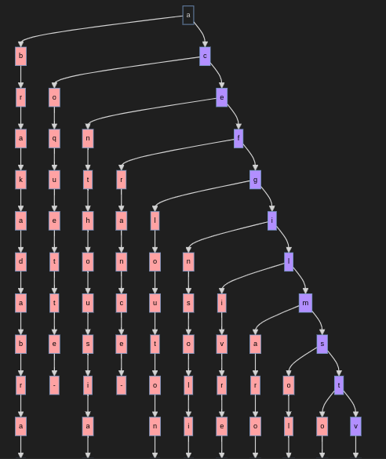
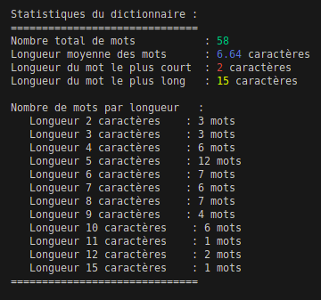
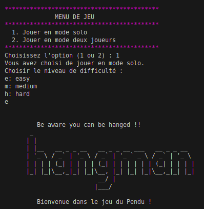
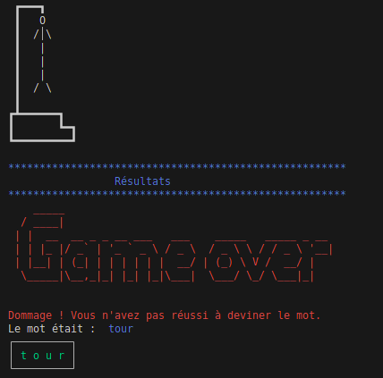
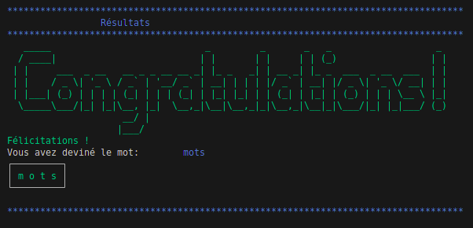

# Hangman Game
In this project, we explore the fun world of manipulating dictionaries and playing the classic Hangman game in various modes and difficulty levels using the power of the C programming language. 

Our project provides a smooth experience for users to interact with the game, explore the details of the dictionary, and challenge themselves with word-guessing fun.

 ## Features 
- Add words to the dictionary.

- Visualize the word tree.

- Search for a specific word.

- Delete a word from the dictionary.

- View dictionary statistics.

- Play the classic Hangman game.

 ## Modes
- Solo Mode: The system randomly selects a word according to the chosen difficulty level. The player's objective is to guess the word within the maximum allowed attempts.
  
- Duo Mode: In this mode, Player 1 proposes a word for Player 2 to guess. The challenge is for Player 2 to correctly guess the word suggested by Player 1.
 ## Levels of difficulty
  
There are three levels of difficulty: easy, medium, and hard. 

These difficulty levels are determined based on the length of the word to be guessed and the number of attempts allowed to guess it.

## Run the project & Play the game : 
First install the Preview Mermaid extention on VSCode for tree visualisation.

Move to the project directory then compile and build with the following command : 
```bash
$ make
```
To run : 

```bash
./hangman
```
## Project Overview :

### Menu


### Dictionary Tree View


### Dictionary Statistics


### Play the game


