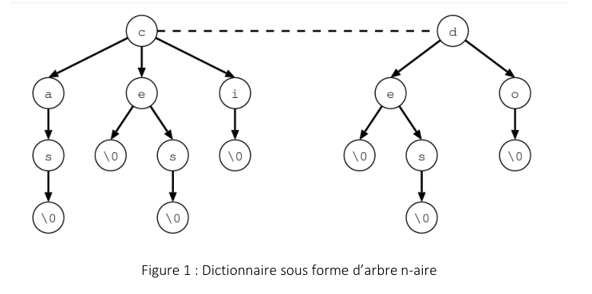
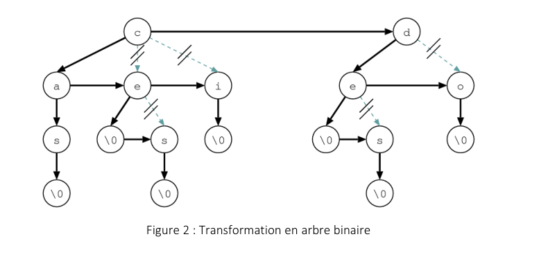
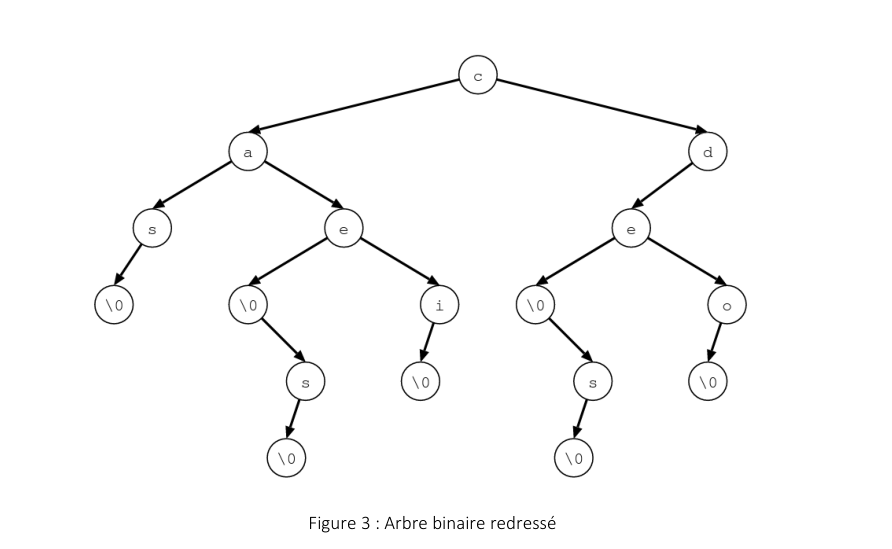

# mini projet Algorithmique : Jeu du Pendu avec Arbre Binaire de Recherche

## Objectif du projet :
Le but de ce petit projet est de programmer le jeu du pendu en utilisant un arbre de recherche
binaire. Afin d'autoriser une recherche rapide des mots dans le dictionnaire, d'offrir une
efficacité pour déterminer si un mot est inclus dans le dictionnaire et de faciliter l'ajout de
nouveaux mots.

## Fonctionnalités: 
- Création d’un dictionnaire de mots sous une forme arborescente: Les différents mots du jeu seront stockés dans un fichier texte puis représenté sous forme d’un arbre binaire de recherche, comme décrit ci-dessous.
- Gérer le dictionnaire des mots : Avoir la possibilité d’ajouter, de supprimer et de
rechercher des mots.
- Jeu du Pendu : L'arbre binaire de recherche est utilisé pour représenter les mots à deviner. À chaque tour, le joueur propose une lettre. En fonction de la lettre proposée, le programme parcourt l'arbre pour vérifier si la lettre est présente dans le mot à deviner. Si la lettre est présente, le programme affiche les emplacements de la lettre dans le mot. Sinon, le programme dessine une partie du pendu.

## Plus de détails :
### Représentation du dictionnaire :
Afin de simplifier la gestion du dictionnaire, nous allons opter pour une représentation à l'aide d'arbres binaires interprétés de manière particulière. Chaque nœud de l’arbre binaire N est le fils d’un autre **nœud P**(sauf pour la racine). Le **fils droit de N** dans l’arbre binaire correspond au **fils suivant de P** dans l’arbre de départ, et le **fils gauche de N** dans l’arbre binaire correspond au
**premier de ses fils dans l’arbre de départ**. Dans le cas du dictionnaire, donc, le fils droit est un pointeur vers une autre lettre possible en même position et le fils gauche est un pointeur vers
la suite possible du mot. Les choses seront plus claires sur un exemple...

#### Exemple:
Si le dictionnaire se compose des mots "cas", "ce", "ces", "ci", "de", "des" et "do", sa
représentation sous forme d’arbre n-aire sera la suivante 

Dans cet exemple, le caractère \0 permet de dire que "ce" est un mot en même temps qu’une
partie de "ces", alors que "ca" n’est pas un mot, mais seulement une partie de "cas".
Pour traduire cette représentation en arbre binaire, il suffit de bouger certaines flèches. Nous
obtenons ainsi l’arborescence décrite à la figure 2. Nous pouvons ensuite tourner un peu
l’arbre pour avoir une vision d’arbre binaire classique (figure 3).

En utilisant la représentation binaire, l’interprétation est la suivante : descendre vers la gauche
correspond à passer à la lettre suivante dans le corps d’un mot; descendre vers la droite
correspond à passer à une autre lettre en même position. Notez bien que pour une plus grande
efficacité, les lettres qui se suivent de fils droit en fils droit sont ordonnées.

### Création du dictionnaire:
Créer un fichier texte dans le même répertoire que le projet.

Mettre un nombre de mots pas moins de 100. Les mots sont écrits un mot par ligne.
### Etapes du jeu:
 À chaque tour, le joueur propose une lettre pour essayer de deviner le mot.

Le programme commence à parcourir l'arbre à partir de la racine en utilisant la lettre
proposée par le joueur.


 Il suit le chemin dans l'arbre correspondant à la séquence de lettres proposée.


 En fonction de la lettre proposée, le programme vérifie si cette lettre est présente dans
le mot à deviner.

 
Si la lettre est présente, le programme identifie les emplacements de cette lettre dans
le mot.

 
Si la lettre proposée est présente dans le mot, le programme affiche les positions où
cette lettre apparaît dans le mot à deviner. Par exemple, s'il y a trois occurrences de la
lettre "a", le programme affiche ces trois positions dans le mot.


 Si la lettre proposée n'est pas présente dans le mot, le programme dessine une partie
du pendu.

 Chaque tentative infructueuse est représentée graphiquement en dessinant une
nouvelle partie du pendu, jusqu'à la fin du jeu ou la création complète du dessin du
pendu (c'est-à-dire, un certain nombre d'essais épuisés).

### Options du jeu :

 Il est préférable d’avoir plusieurs niveaux de difficultés dans le jeu : C’est à
vous de décider par apport aux critères de division des niveaux (longueur des
mots, fréquence des lettres, etc.).

 Le nombre de tentatives sera programmé en fonction du niveau de difficulté
choisi par l’utilisateur au début du jeu.

## Travail demandé:
Développer une petite application de jeu de pendu. Dans cette application il est obligatoire
d'utiliser un arbre binaire de recherche pour permettre une recherche rapide des mots du
dictionnaire et offrir une efficacité pour vérifier si un mot fait partie du dictionnaire et pour
ajouter de nouveaux mots facilement.

Pour la programmation, il est conseillé d'utiliser le langage C. L’utilisation des interfaces
graphiques est optionnelle.

Le projet du jeu du pendu peut être réalisé en binôme ou en trinôme.

L’ajout d’autres fonctionnalités d’amélioration est recommandé.